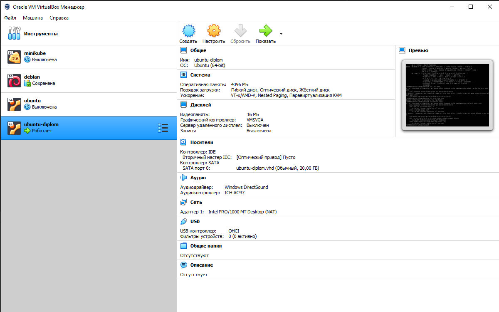
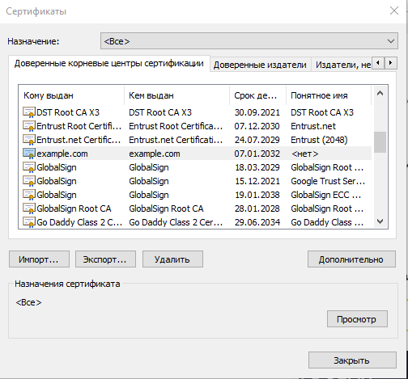
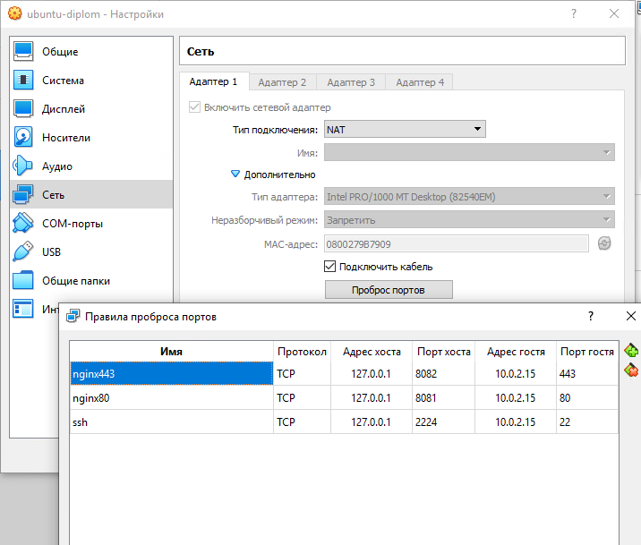
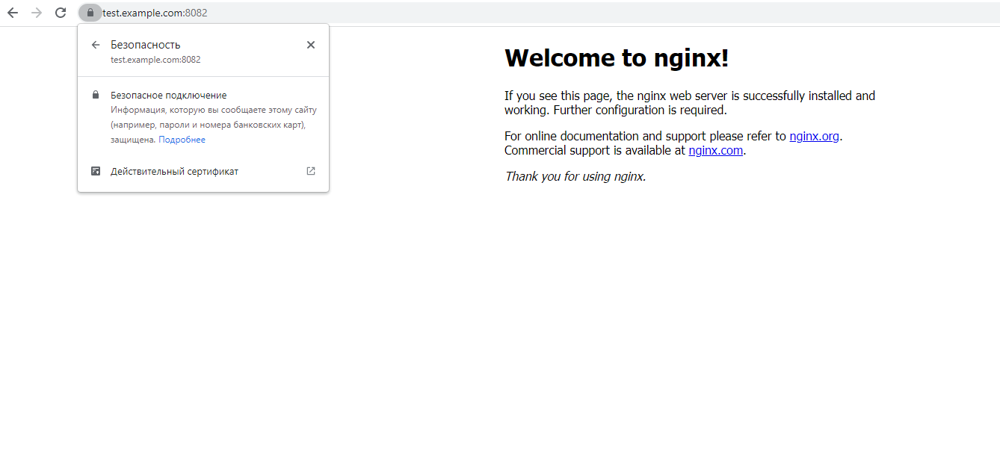

## Курсовая работа по итогам модуля "DevOps и системное администрирование"
1. **Создайте виртуальную машину Linux.**

2. **Установите ufw и разрешите к этой машине сессии на порты 22 и 443, при этом трафик на интерфейсе localhost (lo) должен ходить свободно на все порты.**  
Ubuntu 20.04 ufw installed by default  
`ufw --version`  
ufw 0.36  
Copyright 2008-2015 Canonical Ltd.  
`ufw allow 22`  
`ufw allow 443`  
`ufw allow from 127.0.0.0/8`  
`ufw allow in on lo`  
`ufw allow out on lo`  
`ufw enable`
3. **Установите hashicorp vault ([инструкция по ссылке](https://learn.hashicorp.com/tutorials/vault/getting-started-install?in=vault/getting-started#install-vault)).**  
`curl -fsSL https://apt.releases.hashicorp.com/gpg | sudo apt-key add -`  
`sudo apt-add-repository "deb [arch=amd64] https://apt.releases.hashicorp.com $(lsb_release -cs) main"`  
`sudo apt-get update && sudo apt-get install vault`  
`vault --version`  
<font size=2>Vault v1.9.2 (f4c6d873e2767c0d6853b5d9ffc77b0d297bfbdf)</font>
4. **Cоздайте центр сертификации по инструкции ([ссылка](https://learn.hashicorp.com/tutorials/vault/pki-engine?in=vault/secrets-management)) и выпустите сертификат для использования его в настройке веб-сервера nginx (срок жизни сертификата - месяц).**  

`screen -S Vault`  
`vault server -dev -dev-root-token-id root`  
<font size=2>ctrl+a d</font>  
`export VAULT_ADDR=http://127.0.0.1:8200`  
`export VAULT_TOKEN=root`

_Step 1: Generate root CA_  
`vault secrets enable pki`  
`vault secrets tune -max-lease-ttl=87600h pki`  
```bash
vault write -field=certificate pki/root/generate/internal \
     common_name="example.com" \
     ttl=87600h > CA_cert.crt
```
```bash
vault write pki/config/urls \
     issuing_certificates="$VAULT_ADDR/v1/pki/ca" \
     crl_distribution_points="$VAULT_ADDR/v1/pki/crl"
```
_Step 2: Generate intermediate CA_  
`vault secrets enable -path=pki_int pki`  
`vault secrets tune -max-lease-ttl=43800h pki_int`  
`apt install jq`  
```bash
vault write -format=json pki_int/intermediate/generate/internal \
     common_name="example.com Intermediate Authority" \
     | jq -r '.data.csr' > pki_intermediate.csr
```
```bash
vault write -format=json pki/root/sign-intermediate csr=@pki_intermediate.csr \
     format=pem_bundle ttl="43800h" \
     | jq -r '.data.certificate' > intermediate.cert.pem
```
`vault write pki_int/intermediate/set-signed certificate=@intermediate.cert.pem`  

_Step 3: Create a role_  
```bash
vault write pki_int/roles/example-dot-com \
     allowed_domains="example.com" \
     allow_subdomains=true \
     max_ttl="750h"
```
_Step 4: Request certificate_  
`vault write -format=json pki_int/issue/example-dot-com common_name="test.example.com" ttl="750h" > test.example.com.json_data`
5. **Установите корневой сертификат созданного центра сертификации в доверенные в хостовой системе.**  
Копируем CA_cert.crt на хост и добавляем в доверенные корневые центры сертификации:  

6. **Установите nginx.**  
`apt install nginx`  
7. <b>По инструкции ([ссылка](https://nginx.org/en/docs/http/configuring_https_servers.html)) настройте nginx на https, используя ранее подготовленный сертификат:
  - можно использовать стандартную стартовую страницу nginx для демонстрации работы сервера;
  - можно использовать и другой html файл, сделанный вами;</b>  

Создаем папку /etc/nginx/ssl/ и копируем в неё сертификат и ключ:  
`mkdir /etc/nginx/ssl`  
`cat test.example.com.json_data | jq -r .data.certificate > /etc/nginx/ssl/test.example.com.crt`  
`cat test.example.com.json_data | jq -r .data.issuing_ca >> /etc/nginx/ssl/test.example.com.crt`  
`cat test.example.com.json_data | jq -r .data.private_key > /etc/nginx/ssl/test.example.com.key`  

Далее открываем конфиг /etc/nginx/sites-available/default, редактируем:
```
server {
	listen 443 ssl;
	server_name test.example.com;
	ssl_certificate	/etc/nginx/ssl/test.example.com.crt;
	ssl_certificate_key /etc/nginx/ssl/test.example.com.key;
	#...
}
```
`systemctl restart nginx`
8. **Откройте в браузере на хосте https адрес страницы, которую обслуживает сервер nginx.**  
Пробрасываем порты с гостевой виртуалки на хост:  

Прописываем на хосте в файле hosts 127.0.0.1 test.example.com, открываем в браузере, удостоверяемся, что все ок: 

``
9. <b>Создайте скрипт, который будет генерировать новый сертификат в vault:
  - генерируем новый сертификат так, чтобы не переписывать конфиг nginx;
  - перезапускаем nginx для применения нового сертификата.</b>  
`vim /home/devops/nginx-cert-update.sh`  
```bash
#!/usr/bin/env bash
cd /home/devops/
vault write -format=json pki_int/issue/example-dot-com common_name="test.example.com" ttl="750h" > test.example.com.json_data
if [ "$?" -eq "0" ]
then
cat test.example.com.json_data | jq -r .data.certificate > /etc/nginx/ssl/test.example.com.crt
cat test.example.com.json_data | jq -r .data.issuing_ca >> /etc/nginx/ssl/test.example.com.crt
cat test.example.com.json_data | jq -r .data.private_key > /etc/nginx/ssl/test.example.com.key
systemctl restart nginx
else
  date >> nginx-cert-update-error.log
  echo [ERROR] Error occurred while issuing new certificate
fi
```  
`chmod +x /home/devops/nginx-cert-update.sh`
10. **Поместите скрипт в crontab, чтобы сертификат обновлялся какого-то числа каждого месяца в удобное для вас время.**  
`crontab -e`  
`0 1 1 * * /home/devops/nginx-cert-update.sh`
