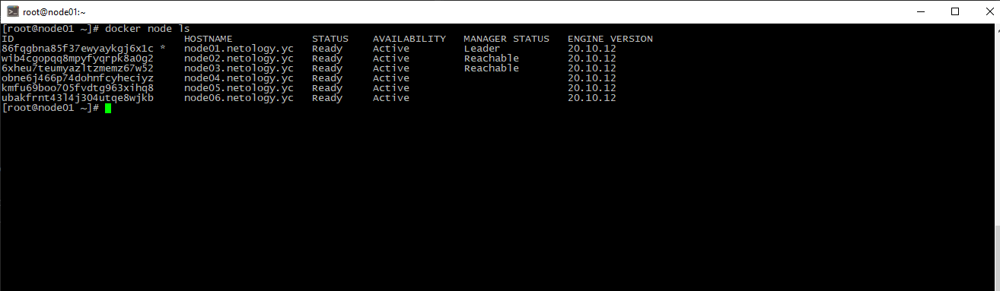
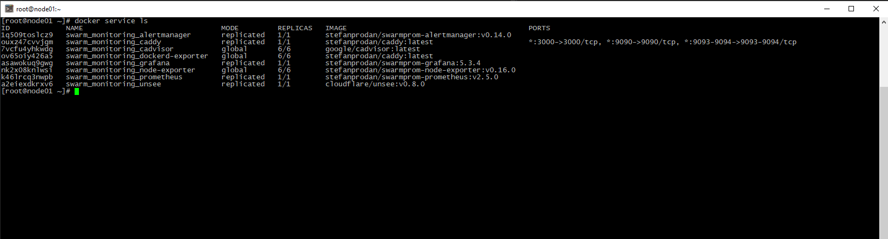

# Домашнее задание к занятию "5.5. Оркестрация кластером Docker контейнеров на примере Docker Swarm"

## Задача 1

Дайте письменые ответы на следующие вопросы:

- В чём отличие режимов работы сервисов в Docker Swarm кластере: replication и global?  
<b>Режим replication указывает, что экземпляров описанного контейнера в кластере docker-swarm может быть сколько угодно, а режим global - по одному экземпляру контейнера на каждой ноде</b>
- Какой алгоритм выбора лидера используется в Docker Swarm кластере?  
<b>Raft</b>
- Что такое Overlay Network?  
<b>Overlay сеть это виртуальная подсеть создаваемая кластером docker-swarm для связи контейнеров между собой (даже если они находятся на разных хостах). Также таким образом при необходимости обеспечивается сетевое разделение сервисов, что в свою очередь положительно влияет на безопасность.</b>

## Задача 2

Создать ваш первый Docker Swarm кластер в Яндекс.Облаке

Для получения зачета, вам необходимо предоставить скриншот из терминала (консоли), с выводом команды:
```
docker node ls
```
<p align="center">
  
</p>
## Задача 3

Создать ваш первый, готовый к боевой эксплуатации кластер мониторинга, состоящий из стека микросервисов.

Для получения зачета, вам необходимо предоставить скриншот из терминала (консоли), с выводом команды:
```
docker service ls
```

<p align="center">
  
</p>

